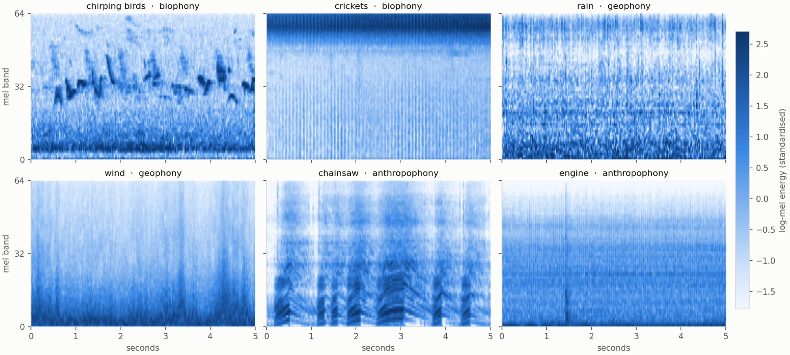
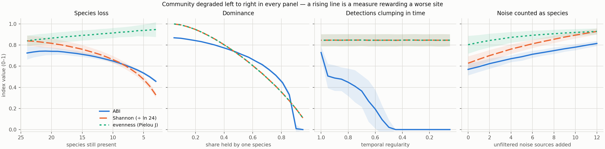
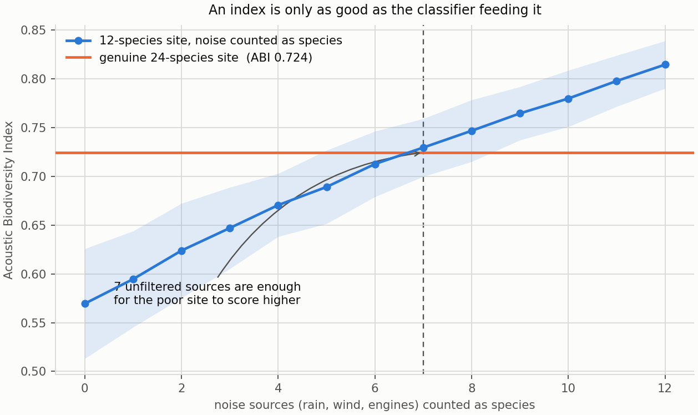
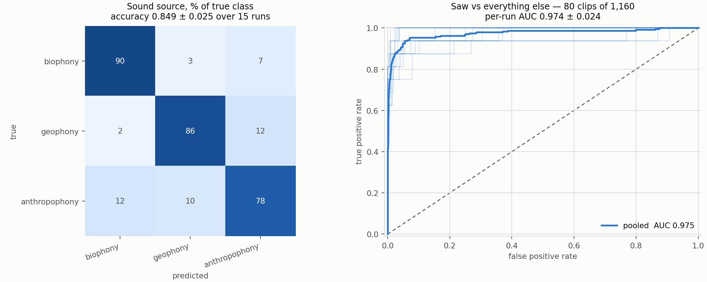

# Acoustic biodiversity

**A biodiversity index for soundscapes, written down explicitly and tested against
communities whose true composition is known.**

A single microphone in a forest hears everything: birds, frogs and insects, but also
rain, wind and — if you are unlucky — a chainsaw. Turning a month of that into one
number that means *how much life is here* takes two things: a classifier that knows
which sounds came from animals, and an index that behaves sensibly when the community
changes. This repository builds both on open data and measures where each one breaks.

---

> ### Source code is not public
>
> The repository holding the code is private. **The source is available for
> technical review under NDA** — contact me through the links at the end of
> this page. This page documents the method and the measured results.

---

---

## Prior work — the field deployment this comes from

M. Saeed, M. H. Alhosani, Y. F. Al Wahedi, **D. Mikhaylov**, M. Brown.
*Leveraging Acoustic Monitoring and AI for Comprehensive Biodiversity Assessment in
Zimbabwe.* Abu Dhabi Maritime Academy · University of Maryland.

A Wildlife Acoustics Song Meter SM4 ran for a month (December 2023) in the Chirundu
forest, inside a ~320,000-hectare conservation area managed by the My Trees Trust,
collecting 1.7 GB of audio. A CNN trained on the Rainforest Connection species set
(24 bird and frog species, 4,727 training and 1,992 test samples) was applied to the
field recordings to produce a detection time series, and the **Acoustic Biodiversity
Index** was formed from species richness, species evenness and temporal stability.

Reported: classifier **85% accuracy across 24 species**, F1 ≈ 0.8; Shannon entropy
**2.93**, normalised **0.95**, mean coefficient of variation **0.41**, **ABI 0.67**.

Those figures belong to that paper and to field recordings that cannot be released.
This repository is the open half: the index written out as runnable code, and the
question the paper had no room for — **does it move the right way?**

---

## The index

Three components, each on [0, 1], combined by geometric mean:

| Component | Definition | What it catches |
|---|---|---|
| **richness** | species detected ÷ species the classifier can recognise | outright loss of species |
| **evenness** | Pielou's J = H ÷ ln S | one species drowning out the rest |
| **stability** | 1 − mean coefficient of variation across time windows | detections that come in one burst and never return |

The geometric mean is the choice worth arguing about, and `abi.py` argues for it: a
site with twenty species heard once each in a single hour is not biodiverse, and an
arithmetic mean still scores it around 0.6. The geometric mean sends any index with
one failing component towards zero. Both are implemented, so the difference can be
measured instead of asserted.

**The published paper does not print the combining function.** Rather than guess at it
and claim to reproduce ABI 0.67, this repository states a formula and then does the
thing that actually makes an index usable by someone else: measures its behaviour.

## Does it move the right way?

Four degradations, 3,000 synthetic communities, composition known by construction.
In every panel the community gets **worse from left to right**, so a rising line is a
measure rewarding a worse site.

Three things come out of this, and only one of them is comfortable.

**Temporal stability earns its place.** In the third panel the same species are
present at the same totals, but their detections clump into fewer and fewer windows —
a community going quiet. Shannon moves from 2.688 to 2.686. Simpson moves from 0.901
to 0.901. Neither classical index can see it at all, because neither looks at time.
ABI falls from 0.729 to 0.000. This is the case that justifies a new index rather
than reaching for Shannon.

**Evenness points the wrong way.** In the first panel, as the rarest species fall
silent one by one, Pielou's J *rises* from 0.839 to 0.946. That is not a bug in this
implementation — it is what J does, because its denominator is the number of species
you still detect. Anyone putting evenness inside a conservation metric should know
that losing rare species improves that term. Here richness outweighs it and the
composite still falls correctly, but the tension is real and it is drawn rather than
hidden.

**The index can be faked by weather.** This is the uncomfortable one.

Take a genuinely poor site — 12 species — and let unfiltered noise sources through as
if each were a species: rain on the housing, wind, a passing engine. Each contaminant
is steady and fairly loud, which is the profile that flatters *all three* components
at once: richness up, evenness up, stability up.

**Seven unfiltered sources are enough for the 12-species site to outscore a genuine
24-species forest** (0.730 against 0.724). Nothing about the index protects it. The
protection has to come from the classifier in front of it — which is the other half
of this repository.

---

## The classifier in front of the index

Soundscape ecology splits an acoustic environment into three sources (Pijanowski et
al. 2011): **biophony** — the animals; **geophony** — wind, rain, water, thunder;
**anthropophony** — everything humans make. 29 ESC-50 categories fall cleanly into the
three, 1,160 clips in all. Categories that are indoor or ambiguous in a forest are
left out rather than forced into a bucket.

`chainsaw` and `hand_saw` are kept deliberately. A sensor in a conservation forest is
there to hear illegal logging, and a saw is the sound of it — so alongside the
three-way head there is a saw detector, 80 clips against 1,080, scored by ROC-AUC and
balanced accuracy because at 7% positives accuracy means nothing.

| | metric | mel-CNN | linear baseline | chance |
|---|---|---|---|---|
| **Sound source** (3-way) | accuracy | **0.849 ± 0.025** | 0.520 ± 0.041 | 0.414 (majority) |
| | balanced accuracy | **0.846 ± 0.025** | — | 0.333 |
| **Saw detector** (80 of 1,160) | ROC-AUC | **0.974 ± 0.024** | 0.601 ± 0.054 | 0.500 |
| | balanced accuracy | **0.936 ± 0.034** | — | 0.500 |

The saw is the easy part — a two-stroke engine against birdsong is not a subtle
discrimination, and AUC 0.974 says so. The three-way split is the harder one, and
0.849 is where the honest ceiling sits for this model on this data.

Five official ESC-50 folds, three seeds, fifteen runs, mean ± standard deviation.

**The confusion matrix is where the two halves of this repository meet.** 12% of
anthropophony is heard as biophony, and 7% of biophony as anthropophony. That first
number is the leak the contamination scenario models: every engine misfiled as an
animal is one more phantom species in the detection stream, and seven of those are
enough to make a depleted forest outscore an intact one.

---

## Honest limitations

- **The synthetic communities are synthetic.** Poisson detections from per-species
  rates. Real detection streams have diurnal cycles, weather, and a classifier whose
  errors are correlated with the species it confuses. The scenarios establish that the
  index responds correctly to *these* degradations, not that it is field-validated.
- **The field numbers are not reproducible here.** The Zimbabwe recordings are not
  public and the paper does not print the combining function, so ABI 0.67 is quoted,
  never recomputed. Nothing in this repository claims to reproduce it.
- **ESC-50 is not a forest.** It is curated Freesound audio, one dominant source per
  clip, five seconds, clean. A real field recorder hears rain *and* birds *and* an
  engine simultaneously, and the three-way accuracy here is an upper bound on what
  the same model would do on overlapping sources.
- **`chirping_birds` is 40 clips.** So is every other category. The biophony class is
  mostly farm animals — dog, cow, sheep, hen — because that is what ESC-50 contains.
  It is a proxy for the biophony/geophony/anthropophony distinction, not a species
  classifier for African woodland.
- **The saw detector is 80 positives.** Enough to show the signal is strong and easy;
  not enough to set an operating threshold for a deployment.
- **Contamination is modelled as clean extra "species".** Real leakage is messier and
  probably worse: a classifier confusing rain for an insect chorus will produce
  detections correlated with weather, not the steady independent stream simulated
  here.

`abi.py` and `experiments.py` have no dependency on the audio half — if all you want
is the index, those two files and numpy are the whole thing.

## Licence and data

Code **MIT**. **ESC-50** is CC BY-NC 3.0 (K. J. Piczak, *ESC: Dataset for
Environmental Sound Classification*, ACM Multimedia 2015) and is downloaded at setup
rather than redistributed here — the non-commercial term travels with it.

## Related

- [**cough-spectrograms**](https://github.com/drdmitrymikhaylov/cough-spectrograms) —
  the same mel-spectrogram pipeline and the same reporting discipline applied to
  clinical audio.
- [**making-pinns-work**](https://github.com/drdmitrymikhaylov/making-pinns-work) —
  why physics-informed neural networks fail to converge, measured over seeds.
- [**oreforge**](https://github.com/drdmitrymikhaylov/oreforge) — a PINN solver inside
  a 3D ore-body modelling application.

---

**Prof. Dr. Dmitry Mikhaylov** · Abu Dhabi, UAE
[LinkedIn](https://www.linkedin.com/in/dmitry-mikhaylov) ·
[ORCID](https://orcid.org/0009-0009-2108-6820) ·
[Substack](https://dmitrymikhaylov.substack.com)
